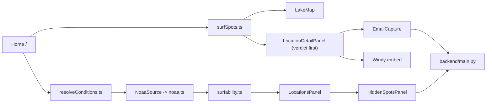

# surf-app-rerun — agent handoff

Attach this file (`@CONTEXT.md`) when starting a new chat. The short always-on rule in `.cursor/rules/project-context.mdc` points here.

**As of 2026-09-03.** Working branch: `dev/rebuild`. Last commit: `b2c2d2c` ("Add gated hidden spots + subscription…"). All 5 steps of the verdict-first build brief are committed on `dev/rebuild`. Nothing has been merged to `main` or deployed.

---

## What this is

Lake Michigan surf conditions app. The product sells a **decision**, not a dashboard: a decisive go / marginal / not-today verdict on 13 curated catalog breaks, backed by live NOAA data. Core loop:

1. Open a Leaflet map of curated catalog breaks.
2. Select a spot (marker, drawer, or snap-click within ~15 km).
3. See the verdict first — NOAA readings and a Windy embed are available below it as "the detail, if you want it."
4. Optionally leave an email to be notified when a session lines up, or subscribe for alerts on hidden breaks not shown on the free map.

Frontend-first (`frontend/`). `backend/main.py` (FastAPI) is now the app's real API host — NOAA proxy, email capture, and gated hidden-spot reads all live there (see "Backend endpoints" below). Its original location-CRUD endpoints are unused by the UI and stay that way. No accounts system; hidden-spot entitlement is a bearer token issued on subscribe (payment stubbed).

This started as a learning codebase (`learn/v1`). Active work prefers a **better site** over preserving pedagogical scaffolding.

---

## How to work

| Branch | Role |
|--------|------|
| `learn/v1` | Frozen learning snapshot (tag `learn-v1-snapshot`). Diff / cherry-pick only. **Do not commit feature work.** |
| `dev/rebuild` | **Default.** Fast iteration, rewrites, agent-driven regeneration. |
| `main` | S3 deploy via GitHub Actions. Merge from `dev/rebuild` only when asked to ship. |

- Run locally: see "Commands" below (frontend + backend)
- Station check: `npm run test:data` (hits NDBC directly from Node)
- Do not push to `main` unless explicitly promoting to production
- Do not rewrite scoring math or station allowlists unless asked
- Do not restore the backend CRUD-locations UI into the frontend

---

## Where we are

`/` is the only frontend route ([`frontend/src/App.tsx`](frontend/src/App.tsx)). There is no `/Devv1`, `/Share`, `/Test`, or `/spot/:id`.

[`Home.tsx`](frontend/src/pages/Home.tsx) is the product:

- Pins come from [`SURF_SPOTS`](frontend/src/data/surfSpots.ts) (13 catalog breaks), not the backend
- Map snap uses [`snapToNearestSpot`](frontend/src/lib/geo/snapToSpot.ts) (`SNAP_RADIUS_M = 15_000`)
- Conditions flow through a source-agnostic seam ([`lib/conditions/resolveConditions.ts`](frontend/src/lib/conditions/resolveConditions.ts) → [`lib/conditions/sources.ts`](frontend/src/lib/conditions/sources.ts)); NOAA is the only source today, fetched once and scored across every spot ([`useCatalogConditions.ts`](frontend/src/hooks/useCatalogConditions.ts))
- Drawer ([`LocationsPanel.tsx`](frontend/src/components/LocationsPanel.tsx)) lists spots with live surfability badges, plus a "Hidden breaks" subscribe/alerts section at the bottom ([`HiddenSpotsPanel.tsx`](frontend/src/components/HiddenSpotsPanel.tsx))
- Detail is an overlay sheet ([`LocationDetailPanel.tsx`](frontend/src/components/LocationDetailPanel.tsx)) that leads with a **verdict banner** (Go / Marginal / Not today / No verdict yet), then an email-capture form, then NOAA + Windy demoted to "the detail, if you want it"
- Compact header; on viewports under 900px the drawer overlays the map and starts closed
- MUI / Emotion removed. Vite proxies `/api/ndbc/latest_obs.txt` straight to NOAA (dev only) and everything else under `/api` to the local backend ([`vite.config.ts`](frontend/vite.config.ts))



---

## Key files

| Path | Role |
|------|------|
| [`frontend/src/pages/Home.tsx`](frontend/src/pages/Home.tsx) | Selection state, snap-click, drawer, detail sheet |
| [`frontend/src/components/LakeMap.tsx`](frontend/src/components/LakeMap.tsx) | Leaflet map + popups |
| [`frontend/src/components/LocationsPanel.tsx`](frontend/src/components/LocationsPanel.tsx) | Catalog list + scores + hidden-breaks section |
| [`frontend/src/components/LocationDetailPanel.tsx`](frontend/src/components/LocationDetailPanel.tsx) | Verdict banner first, then email capture, then NOAA + Windy |
| [`frontend/src/components/EmailCapture.tsx`](frontend/src/components/EmailCapture.tsx) | "Tell me when a session lines up" (per spot) |
| [`frontend/src/components/HiddenSpotsPanel.tsx`](frontend/src/components/HiddenSpotsPanel.tsx) | Subscribe form (no token) / polling alerts (with token) |
| [`frontend/src/components/PinPopupContent.tsx`](frontend/src/components/PinPopupContent.tsx) | Marker popup |
| [`frontend/src/components/NoaaReadings.tsx`](frontend/src/components/NoaaReadings.tsx) | Wind / wave display (`showVerdict` prop suppresses the badge when a parent already renders one) |
| [`frontend/src/hooks/useCatalogConditions.ts`](frontend/src/hooks/useCatalogConditions.ts) | Calls the conditions seam once; scores all spots |
| [`frontend/src/hooks/useHiddenSpotAlerts.ts`](frontend/src/hooks/useHiddenSpotAlerts.ts) | Token in localStorage; polls `/api/hidden-spots` every 15s |
| [`frontend/src/lib/conditions/sources.ts`](frontend/src/lib/conditions/sources.ts) | `ConditionsSource` interface + `NoaaSource` |
| [`frontend/src/lib/conditions/resolveConditions.ts`](frontend/src/lib/conditions/resolveConditions.ts) | Combines sources per spot (first-non-null); NOAA-only today |
| [`frontend/src/lib/api.ts`](frontend/src/lib/api.ts) / [`lib/hiddenSpots.ts`](frontend/src/lib/hiddenSpots.ts) | Fetch helpers for the backend (`VITE_API_URL`, defaults to relative/proxied) |
| [`frontend/src/services/noaa.ts`](frontend/src/services/noaa.ts) | Parse NDBC, resolve wind vs wave stations, short in-memory cache |
| [`frontend/src/lib/surfability.ts`](frontend/src/lib/surfability.ts) | Score + copy (unchanged since the rebuild) |
| [`frontend/src/data/surfSpots.ts`](frontend/src/data/surfSpots.ts) | 13 spots + station IDs |
| [`frontend/src/data/stationCatalog.ts`](frontend/src/data/stationCatalog.ts) | Nearshore vs offshore allowlists |
| [`backend/main.py`](backend/main.py) | FastAPI: NOAA proxy, notify-me, subscribe, hidden-spots (gated), operator fire/clear; location CRUD (unused, left alone) |
| [`backend/db.py`](backend/db.py) | SQLite (`subscribers`, `hidden_spots`, `subscriber_tokens`) |

---

## Backend endpoints (`backend/main.py`)

| Endpoint | Auth | Purpose |
|---|---|---|
| `GET /api/ndbc/latest_obs.txt` | none | NOAA proxy, 60s cache |
| `POST /api/notify-me` | none | `{email, spotId?}` → persists a lead, idempotent per (email, spot) |
| `POST /api/subscribe` | none | `{email}` → issues/returns a bearer token (payment stubbed, idempotent per email) |
| `GET /api/hidden-spots` | `Authorization: Bearer <token>` | 401 without a valid token — this is the real data boundary |
| `POST /api/operator/hidden-spots/{id}/fire` | `X-Operator-Secret` header = `OPERATOR_SECRET` env var | Human-in-the-loop trigger; fails closed if the env var is unset |
| `POST /api/operator/hidden-spots/{id}/clear` | same | Unsets firing |

Hidden spots are seeded as two clearly-placeholder rows (`secret-point`, `hidden-jetty`) — plumbing demo, not curated real breaks.

---

## Data rules (do not break)

- **Wind:** nearshore C-MAN / pier / lighthouse stations only (`CHII2`, `MCYI3`, `SVNM4`, `MKGM4`, `MLWW3`, `SGNW3`, `45186`, …)
- **Waves:** allowlisted offshore buoys only (`45168`, `45029`, `45024`, `45026`, `45170`, `45210`, `45214`, …). Open-lake reference, not at the surf line
- **Never** read `WVHT` from nearshore stations (they report `MM`)
- A spot succeeds if **wind or wave** data is available (wind-only mode never flags `tooSmall`)

Scoring thresholds (unchanged): too flat &lt; 1.5 ft; good ≥ 2.5 ft; too windy &gt; 22 kt; marginal wind 18–22 kt. Stale = NOAA obs older than 2 hours. `computeSurfability` in `surfability.ts` has not been touched by any step of the build brief — only its presentation (Step 2) and its input seam (Step 4) changed.

---

## Production deploy (what `main` / the S3 pipeline still needs)

Verified on `dev/rebuild`, not done (needs infra choices/credentials this session doesn't have):

1. **Deploy `backend/` somewhere reachable over HTTPS.** Any small Python host works (Render, Fly.io, Railway, an EC2 box, etc.) — host not chosen here. Install from `backend/requirements.txt`, run with e.g. `uvicorn main:app --host 0.0.0.0 --port $PORT`. Set a real `OPERATOR_SECRET` env var (operator endpoints fail closed without one) and a persistent `APP_DB_PATH` (defaults to a file next to `main.py`, which is fine as long as the host's filesystem isn't ephemeral between deploys — if it is, this needs a real volume or a swap to a hosted DB before shipping).
2. **Set `VITE_NDBC_URL`** and **`VITE_API_URL`** as build-time env/secrets in [`.github/workflows/deploy.yml`](.github/workflows/deploy.yml), both pointing at `https://<backend-host>` (`VITE_NDBC_URL` needs the full `/api/ndbc/latest_obs.txt` path; `VITE_API_URL` is just the origin — `lib/api.ts` and `lib/hiddenSpots.ts` append their own paths).
3. **Set `ALLOWED_ORIGINS`** on the deployed backend (comma-separated env var, defaults to localhost dev origins only) to the production S3/CloudFront domain.

Without this, the deployed frontend still builds and serves, but NOAA data, email capture, and hidden-spot subscription all fail against the S3 origin (no backend to talk to).

---

## Build sequence — complete on `dev/rebuild`

All 5 steps of the verdict-first build brief are committed:

1. ✅ Production NOAA proxy (`backend/main.py`)
2. ✅ Verdict-first detail panel (presentation only, `computeSurfability` unchanged)
3. ✅ Email capture tied to spot intent (`/api/notify-me`, SQLite)
4. ✅ Source-agnostic verdict seam (`lib/conditions/`, zero behavior change)
5. ✅ Gated hidden spots + subscription (bearer-token entitlement, operator fire/clear, in-app polling)

**Out of scope until explicitly asked:** GIS shoreline gating, Windy Point Forecast API (embed only), more catalog spots, scoring changes, beach cameras / CV verdicts, maritime go/no-go, real payment integration, real accounts/passwords, email delivery (notifications are in-app polling only, not sent to inboxes).

---

## Commands

```bash
# Frontend
cd frontend
npm install
npm run dev          # Vite dev server; proxies /api/ndbc/* to NOAA and /api/* to localhost:8000
npm run test:data    # validate all catalog spots against live NDBC
npm run build        # tsc -b && vite build

# Backend (separate terminal)
cd backend
python3 -m venv venv && ./venv/bin/pip install -r requirements.txt   # first time only
OPERATOR_SECRET=<pick-something> ./venv/bin/uvicorn main:app --port 8000
```

`backend/app.db` (SQLite, gitignored) is created automatically on first run.
