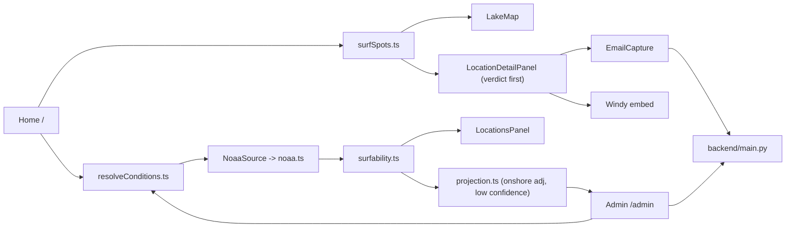

# surf-app-rerun — agent handoff

Attach this file (`@CONTEXT.md`) when starting a new chat. The short always-on rule in `.cursor/rules/project-context.mdc` points here. See also [PARKED.md](PARKED.md) for ideas that were built, then deliberately shelved (not lost — full code recoverable from git history).

**As of 2026-09-08.** Working branch: `dev/rebuild`. Current priority: **demand validation**, not paid-tier build-out — get the free product live, measure who's interested and from which channel. CI/CD (one environment, production-only — see "CI/CD" below) is committed but **not yet live**; needs the one-time Fly.io/GitHub-secrets setup listed there. Nothing has been merged to `main` yet.

---

## What this is

Lake Michigan surf conditions app. The product sells a **decision**, not a dashboard. Two tiers:

- **Free public layer** — anyone opens the catalog map and gets a decisive go / marginal / not-today verdict on 13 curated breaks, backed by live NOAA data. Credibility demo, top of funnel. No create/instrument capability here.
- **Paid layer** — the user becomes an operator: create a **private spot at any coordinate** and get a verdict there, fused from the nearest allowlisted NOAA stations plus a simple onshore/offshore wind adjustment. The paid unit is this capability, not a list of secret spots (see PARKED.md for why that model was tried and shelved). Currently **admin-gated only** — no public signup/billing yet, by design (Step 5 of the current brief).

Frontend-first (`frontend/`). `backend/main.py` (FastAPI) is the app's API host — NOAA proxy, email capture, and gated private-spot CRUD all live there. Its original location-CRUD endpoints are unused by the UI and stay that way.

This started as a learning codebase (`learn/v1`). Active work prefers a **better site** over preserving pedagogical scaffolding.

---

## How to work

| Branch | Role |
|--------|------|
| `learn/v1` | Frozen learning snapshot (tag `learn-v1-snapshot`). Diff / cherry-pick only. **Do not commit feature work.** |
| `dev/rebuild` | **Default.** Fast iteration, rewrites, agent-driven regeneration. |
| `main` | S3 deploy via GitHub Actions. Merge from `dev/rebuild` only when asked to ship. |

- Run locally: see "Commands" below (frontend + backend)
- Station check: `npm run test:data` (hits NDBC directly from Node)
- Do not push to `main` unless explicitly promoting to production
- Do not rewrite scoring math or station allowlists unless asked
- Do not restore the backend CRUD-locations UI into the frontend

---

## Where we are

Two frontend routes ([`frontend/src/App.tsx`](frontend/src/App.tsx)): `/` (public) and `/admin` (private-spot management). No `/Devv1`, `/Share`, `/Test`, or `/spot/:id`.

**`/` — [`Home.tsx`](frontend/src/pages/Home.tsx)** is the free product:

- Pins come from [`SURF_SPOTS`](frontend/src/data/surfSpots.ts) (13 catalog breaks), not the backend
- Map snap uses [`snapToNearestSpot`](frontend/src/lib/geo/snapToSpot.ts) (`SNAP_RADIUS_M = 15_000`)
- Conditions flow through a source-agnostic seam ([`lib/conditions/resolveConditions.ts`](frontend/src/lib/conditions/resolveConditions.ts) → [`lib/conditions/sources.ts`](frontend/src/lib/conditions/sources.ts)); NOAA is the only source today, fetched once and scored across every spot ([`useCatalogConditions.ts`](frontend/src/hooks/useCatalogConditions.ts))
- Drawer ([`LocationsPanel.tsx`](frontend/src/components/LocationsPanel.tsx)) lists catalog spots with live surfability badges
- Detail is an overlay sheet ([`LocationDetailPanel.tsx`](frontend/src/components/LocationDetailPanel.tsx)) that leads with a **verdict banner** (Go / Marginal / Not today / No verdict yet — copy shared with `/admin` via [`lib/verdictCopy.ts`](frontend/src/lib/verdictCopy.ts)), then an email-capture form, then NOAA + Windy demoted to "the detail, if you want it"
- Compact header; on viewports under 900px the drawer overlays the map and starts closed

**`/admin` — [`Admin.tsx`](frontend/src/pages/Admin.tsx)** is the paid capability, admin-only for now:

- Gated by an `ADMIN_SECRET` entered once, stored client-side, sent as `X-Admin-Secret` — but the real boundary is server-side (see "Backend endpoints"); a wrong/missing secret gets a 401 from the API, never data
- Create a spot by clicking a Leaflet map ([`AdminSpotMap.tsx`](frontend/src/components/AdminSpotMap.tsx), same pattern as the public `LakeMap`) — first click places it, second click sets a facing point, [`lib/geo/bearing.ts`](frontend/src/lib/geo/bearing.ts) computes the compass bearing between them. Only the name is typed; lat/lng/facingDeg are never hand-entered → persisted via `POST /api/private-spots`
- Each listed spot's verdict is computed **client-side**, reusing the exact same seam as catalog spots ([`lib/conditions/resolveConditions.ts`](frontend/src/lib/conditions/resolveConditions.ts)) — a private spot is just a `SurfSpot` with no `windStationId`/`waveReferenceBuoyId`, which `noaa.ts` already falls back to nearest-in-range station for — then wrapped by [`lib/conditions/projection.ts`](frontend/src/lib/conditions/projection.ts), which adds an onshore/offshore wind-exposure adjustment and forces confidence to `'low'` with an explicit "Projected verdict" framing
- No real Windy point-data source exists (no API key, still out of scope) — the wind side of the projection is nearshore-station-only, honestly reporting `'unknown'` exposure when nothing is in range rather than guessing
- Leads with an **interest dashboard**: total signups + a by-channel breakdown ([`GET /api/notify-me/stats`](backend/main.py)) — every `/api/notify-me` submission from `/` carries first-touch UTM/referrer attribution ([`lib/attribution.ts`](frontend/src/lib/attribution.ts)), so this is the actual answer to "who's interested and from where"

Vite proxies `/api/ndbc/latest_obs.txt` straight to NOAA (dev only) and everything else under `/api` to the local backend ([`vite.config.ts`](frontend/vite.config.ts)).



---

## Key files

| Path | Role |
|------|------|
| [`frontend/src/pages/Home.tsx`](frontend/src/pages/Home.tsx) | Public: selection state, snap-click, drawer, detail sheet |
| [`frontend/src/pages/Admin.tsx`](frontend/src/pages/Admin.tsx) | Admin-gated: create/list private spots + their projected verdicts |
| [`frontend/src/components/LakeMap.tsx`](frontend/src/components/LakeMap.tsx) | Leaflet map + popups (catalog only) |
| [`frontend/src/components/LocationsPanel.tsx`](frontend/src/components/LocationsPanel.tsx) | Catalog list + scores |
| [`frontend/src/components/LocationDetailPanel.tsx`](frontend/src/components/LocationDetailPanel.tsx) | Verdict banner first, then email capture, then NOAA + Windy |
| [`frontend/src/components/EmailCapture.tsx`](frontend/src/components/EmailCapture.tsx) | "Tell me when a session lines up" (per spot) |
| [`frontend/src/components/NoaaReadings.tsx`](frontend/src/components/NoaaReadings.tsx) | Wind / wave display (`showVerdict` prop suppresses the badge when a parent already renders one) |
| [`frontend/src/hooks/useCatalogConditions.ts`](frontend/src/hooks/useCatalogConditions.ts) | Calls the conditions seam once; scores all catalog spots |
| [`frontend/src/lib/conditions/sources.ts`](frontend/src/lib/conditions/sources.ts) | `ConditionsSource` interface + `NoaaSource` |
| [`frontend/src/lib/conditions/resolveConditions.ts`](frontend/src/lib/conditions/resolveConditions.ts) | Combines sources per spot (first-non-null); NOAA-only today; coordinate-agnostic (used by both `/` and `/admin`) |
| [`frontend/src/lib/conditions/projection.ts`](frontend/src/lib/conditions/projection.ts) | Private-spot-only wrapper: onshore/offshore wind adjustment, forced low confidence, "Projected" framing |
| [`frontend/src/lib/verdictCopy.ts`](frontend/src/lib/verdictCopy.ts) | Shared Go/Marginal/Not-today/No-verdict-yet headline+tone mapping |
| [`frontend/src/components/AdminSpotMap.tsx`](frontend/src/components/AdminSpotMap.tsx) | Leaflet map for `/admin`: click-to-place spot, click-to-set facing point, existing spots shown as markers |
| [`frontend/src/lib/geo/bearing.ts`](frontend/src/lib/geo/bearing.ts) | Compass bearing between two lat/lngs — turns the two map clicks into `facingDeg` |
| [`frontend/src/lib/api.ts`](frontend/src/lib/api.ts) | `/api/notify-me` fetch helper (`VITE_API_URL`, defaults to relative/proxied) |
| [`frontend/src/lib/adminApi.ts`](frontend/src/lib/adminApi.ts) | `/api/private-spots` fetch helpers (admin secret as a header) |
| [`frontend/src/services/noaa.ts`](frontend/src/services/noaa.ts) | Parse NDBC, resolve wind vs wave stations (nearest-in-range fallback), short in-memory cache |
| [`frontend/src/lib/surfability.ts`](frontend/src/lib/surfability.ts) | Score + copy (unchanged since the rebuild — no step has touched scoring math) |
| [`frontend/src/data/surfSpots.ts`](frontend/src/data/surfSpots.ts) | 13 catalog spots + station IDs |
| [`frontend/src/data/stationCatalog.ts`](frontend/src/data/stationCatalog.ts) | Nearshore vs offshore allowlists; nearest-station fallback is what makes private spots work with no code changes |
| [`backend/main.py`](backend/main.py) | FastAPI: NOAA proxy, notify-me, private-spots (admin-gated); location CRUD (unused, left alone) |
| [`backend/db.py`](backend/db.py) | SQLite (`subscribers`, `private_spots`) |

---

## Backend endpoints (`backend/main.py`)

| Endpoint | Auth | Purpose |
|---|---|---|
| `GET /api/ndbc/latest_obs.txt` | none | NOAA proxy, 60s cache |
| `POST /api/notify-me` | none | `{email, spotId?}` → persists a lead, idempotent per (email, spot) |
| `POST /api/private-spots` | `X-Admin-Secret` header = `ADMIN_SECRET` env var | `{name, lat, lng, facingDeg}` → creates a private spot; fails closed if the env var is unset |
| `GET /api/private-spots` | same | Lists all private spots (id, name, lat, lng, facingDeg, createdAt) — no verdict computed server-side, the client fuses conditions via the seam |

Verdict computation for private spots stays entirely client-side (same code path as catalog spots) — the backend's job here is only the gated persistence boundary, not scoring.

---

## Data rules (do not break)

- **Wind:** nearshore C-MAN / pier / lighthouse stations only (`CHII2`, `MCYI3`, `SVNM4`, `MKGM4`, `MLWW3`, `SGNW3`, `45186`, …)
- **Waves:** allowlisted offshore buoys only (`45168`, `45029`, `45024`, `45026`, `45170`, `45210`, `45214`, …). Open-lake reference, not at the surf line
- **Never** read `WVHT` from nearshore stations (they report `MM`)
- A spot succeeds if **wind or wave** data is available (wind-only mode never flags `tooSmall`)

Scoring thresholds (unchanged): too flat &lt; 1.5 ft; good ≥ 2.5 ft; too windy &gt; 22 kt; marginal wind 18–22 kt. Stale = NOAA obs older than 2 hours. `computeSurfability` in `surfability.ts` has never been touched by any step of any build brief — only its presentation (Step 2), its input seam (Step 4), and now a private-spot-only wrapper on top of it (`projection.ts`) exist. The private-spot onshore/offshore adjustment lives entirely in `projection.ts` and never changes catalog-spot output.

---

## CI/CD — one environment, automated

Deliberately **one environment** (production, deployed from `main`), not the dev+prod split from a couple sessions ago. Current phase is demand validation — establish who's interested and which channel actually works, via [attribution.ts](frontend/src/lib/attribution.ts) + the `/admin` interest stats — not running paid-tier infrastructure nobody's paying for yet. A second environment is one more Fly app + one more S3 bucket away whenever it's actually needed again; nothing here forecloses that.

**Frontend (S3):** `main` push → [`.github/workflows/deploy.yml`](.github/workflows/deploy.yml) → the existing production bucket (`secrets.S3_BUCKET`). Unchanged except for the two `VITE_*` build env vars below, which it needs to actually reach the backend.

**Backend (Fly.io):** `main` push (when `backend/**` changes) → [`.github/workflows/deploy-backend.yml`](.github/workflows/deploy-backend.yml) → `flyctl deploy --remote-only` using [`backend/fly.toml`](backend/fly.toml) (Fly builds the [`Dockerfile`](backend/Dockerfile) remotely — no Docker needed locally or in CI). Persistent volume mounted at `/data` (`APP_DB_PATH=/data/app.db`) so SQLite survives restarts/redeploys. Scales to zero when idle (`min_machines_running = 0`) to minimize cost — first request after idle has a cold-start delay; bump to `1` in `fly.toml` if that becomes annoying. `FLY_API_TOKEN` is a different provider from the frontend's AWS keys, not a broader AWS grant.

**One-time manual setup (not automatable — needs your own account/CLI):**

1. Create a Fly.io account, then locally: `fly auth login`.
2. `fly apps create lake-surf-api` — **app names are globally unique across all Fly users**; if taken, pick an alternative and update it in `backend/fly.toml`'s `app =` line and in `.github/workflows/deploy.yml`'s two `VITE_*` values (hardcoded to `https://lake-surf-api.fly.dev`).
3. `fly volumes create surf_data --app lake-surf-api --region ord --size 1`.
4. `fly secrets set ADMIN_SECRET=<pick-something-real> --app lake-surf-api`. `ALLOWED_ORIGINS` too, once you know the production frontend URL (`fly secrets set ALLOWED_ORIGINS=https://<bucket>.s3-website-<region>.amazonaws.com --app lake-surf-api`).
5. `fly tokens create` (or `fly auth token`) → add as GitHub repo secret `FLY_API_TOKEN`.

None of these steps involve pasting a secret to me or into this repo — GitHub secrets and Fly's own secret store are the only places they live. No new AWS credentials needed; the existing `AWS_ACCESS_KEY_ID`/`AWS_SECRET_ACCESS_KEY`/`AWS_REGION`/`S3_BUCKET` secrets are reused as-is.

Not done: verifying the whole loop end-to-end once secrets are in place (push to `main`, check the Actions tab, hit the live URL).

---

## Build sequence — complete on `dev/rebuild`

Steps 1–3 (free product, ships first to test demand) and Steps 4–5 (paid tier MVP) are both committed:

1. ✅ Production NOAA proxy (`backend/main.py`)
2. ✅ Verdict-first detail panel (presentation only, `computeSurfability` unchanged)
3. ✅ Email capture tied to spot intent (`/api/notify-me`, SQLite)
4. ✅ Source-agnostic verdict seam (`lib/conditions/sources.ts` + `resolveConditions.ts`, zero behavior change, coordinate-agnostic — this is what makes Step 5 possible with no changes to `noaa.ts`)
5. ✅ MVP paid tier: admin-gated private spot creation at any coordinate + minimum-honest fusion projection (`lib/conditions/projection.ts`), confidence always stated as low, admin-only (`/admin`, `ADMIN_SECRET`)

An earlier version of Step 5 (curated hidden spots + subscriber tokens + human-fires-it notifications) was built, verified, then **parked** — see [PARKED.md](PARKED.md) — when the brief clarified the paid unit is capability, not a spot list.

**Out of scope until explicitly asked:** GIS shoreline gating, Windy Point Forecast API (embed only — no key, no real point-data fusion), more catalog spots, scoring changes, full meteorological projection (shoaling/refraction/fetch decay), public auth & billing, camera ingestion / CV verdicts, edge compute (Jetson) integration, maritime go/no-go.

---

## Commands

```bash
# Frontend
cd frontend
npm install
npm run dev          # Vite dev server; proxies /api/ndbc/* to NOAA and /api/* to localhost:8000
npm run test:data    # validate all catalog spots against live NDBC
npm run build        # tsc -b && vite build

# Backend (separate terminal)
cd backend
python3 -m venv venv && ./venv/bin/pip install -r requirements.txt   # first time only
ADMIN_SECRET=<pick-something> ./venv/bin/uvicorn main:app --port 8000
```

`backend/app.db` (SQLite, gitignored) is created automatically on first run. Visit `/admin` and enter the same `ADMIN_SECRET` to manage private spots.
