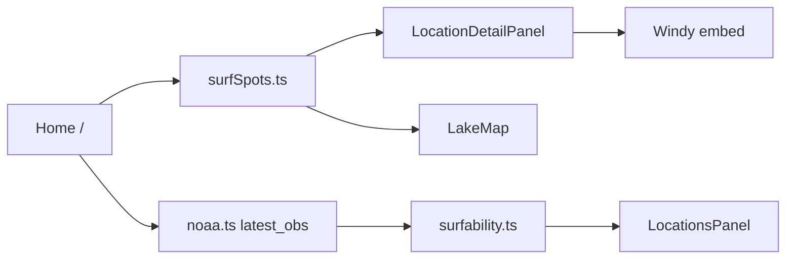

# surf-app-rerun — agent handoff

Attach this file (`@CONTEXT.md`) when starting a new chat. The short always-on rule in `.cursor/rules/project-context.mdc` points here.

**As of 2026-09-03.** Working branch: `dev/rebuild`. Last commit: `97ba20c` (“Unify locations UX with drill-in panel…”). The catalog-only rebuild described below is **in the working tree and not committed**. Do not treat it as shipped.

---

## What this is

Lake Michigan surf conditions app. Core loop:

1. Open a Leaflet map of curated catalog breaks.
2. Select a spot (marker, drawer, or snap-click within ~15 km).
3. Review live NOAA NDBC wind + waves and an explainable surfability score.
4. View a Windy embed for the same coordinates.

Frontend-first (`frontend/`). The FastAPI backend (`backend/main.py`) now hosts a server-side NOAA proxy (`GET /api/ndbc/latest_obs.txt`) — see "Production deploy" below. Its CRUD-locations endpoints are unused by the UI and stay that way; only new endpoints are added. No auth.

This started as a learning codebase (`learn/v1`). Active work prefers a **better site** over preserving pedagogical scaffolding. The site does not need production-grade maintenance; keep the NOAA data rules below.

---

## How to work

| Branch | Role |
|--------|------|
| `learn/v1` | Frozen learning snapshot (tag `learn-v1-snapshot`). Diff / cherry-pick only. **Do not commit feature work.** |
| `dev/rebuild` | **Default.** Fast iteration, rewrites, agent-driven regeneration. |
| `main` | S3 deploy via GitHub Actions. Merge from `dev/rebuild` only when asked to ship. |

- Run locally: `cd frontend && npm install && npm run dev`
- Station check: `npm run test:data` (hits NDBC directly from Node)
- Do not push to `main` unless explicitly promoting to production
- Do not rewrite scoring math or station allowlists unless asked

---

## Where we are

`/` is the only frontend route ([`frontend/src/App.tsx`](frontend/src/App.tsx)). There is no `/Devv1`, `/Share`, `/Test`, or `/spot/:id`.

[`Home.tsx`](frontend/src/pages/Home.tsx) is the product:

- Pins come from [`SURF_SPOTS`](frontend/src/data/surfSpots.ts) (13 catalog breaks), not the backend
- Map snap uses [`snapToNearestSpot`](frontend/src/lib/geo/snapToSpot.ts) (`SNAP_RADIUS_M = 15_000`)
- One NOAA `latest_obs.txt` fetch scores every spot ([`useCatalogConditions.ts`](frontend/src/hooks/useCatalogConditions.ts))
- Drawer ([`LocationsPanel.tsx`](frontend/src/components/LocationsPanel.tsx)) lists spots with live surfability badges
- Detail is an overlay sheet ([`LocationDetailPanel.tsx`](frontend/src/components/LocationDetailPanel.tsx)) with NOAA + Windy; it is hidden until a spot is selected
- Compact header; on viewports under 900px the drawer overlays the map and starts closed
- MUI / Emotion removed. Vite proxy is NOAA-only ([`vite.config.ts`](frontend/vite.config.ts))

**Before this uncommitted rebuild**, `dev/rebuild` was a backend CRUD “manage locations” UI. That path (`api/locations.ts`, `catalogMatch.ts`, Layout, mock `spots.ts`) is deleted in the working tree.



---

## Key files

| Path | Role |
|------|------|
| [`frontend/src/pages/Home.tsx`](frontend/src/pages/Home.tsx) | Selection state, snap-click, drawer, detail sheet |
| [`frontend/src/components/LakeMap.tsx`](frontend/src/components/LakeMap.tsx) | Leaflet map + popups |
| [`frontend/src/components/LocationsPanel.tsx`](frontend/src/components/LocationsPanel.tsx) | Catalog list + scores |
| [`frontend/src/components/LocationDetailPanel.tsx`](frontend/src/components/LocationDetailPanel.tsx) | Overlay NOAA + Windy |
| [`frontend/src/components/PinPopupContent.tsx`](frontend/src/components/PinPopupContent.tsx) | Marker popup |
| [`frontend/src/components/NoaaReadings.tsx`](frontend/src/components/NoaaReadings.tsx) | Wind / wave display |
| [`frontend/src/hooks/useCatalogConditions.ts`](frontend/src/hooks/useCatalogConditions.ts) | Fetch bulletin once; score all spots |
| [`frontend/src/hooks/useBuoyData.ts`](frontend/src/hooks/useBuoyData.ts) | `BuoyDataState` type only (no per-spot fetch) |
| [`frontend/src/services/noaa.ts`](frontend/src/services/noaa.ts) | Parse NDBC, resolve wind vs wave stations, short in-memory cache |
| [`frontend/src/lib/surfability.ts`](frontend/src/lib/surfability.ts) | Score + copy |
| [`frontend/src/data/surfSpots.ts`](frontend/src/data/surfSpots.ts) | 13 spots + station IDs |
| [`frontend/src/data/stationCatalog.ts`](frontend/src/data/stationCatalog.ts) | Nearshore vs offshore allowlists |
| [`frontend/src/docs/MVP_VALIDATION.md`](frontend/src/docs/MVP_VALIDATION.md) | Spot/station validation |
| [`frontend/src/docs/NDBC_PIPELINE.md`](frontend/src/docs/NDBC_PIPELINE.md) | NOAA pipeline narrative (some “fetch per selection” language is stale) |
| [`backend/main.py`](backend/main.py) | FastAPI: NOAA proxy (in use); location CRUD (not wired to the UI) |

---

## Data rules (do not break)

- **Wind:** nearshore C-MAN / pier / lighthouse stations only (`CHII2`, `MCYI3`, `SVNM4`, `MKGM4`, `MLWW3`, `SGNW3`, `45186`, …)
- **Waves:** allowlisted offshore buoys only (`45168`, `45029`, `45024`, `45026`, `45170`, `45210`, `45214`, …). Open-lake reference, not at the surf line
- **Never** read `WVHT` from nearshore stations (they report `MM`)
- A spot succeeds if **wind or wave** data is available (wind-only mode never flags `tooSmall`)

Scoring thresholds (unchanged): too flat &lt; 1.5 ft; good ≥ 2.5 ft; too windy &gt; 22 kt; marginal wind 18–22 kt. Stale = NOAA obs older than 2 hours.

Dev NOAA URL: `/api/ndbc/latest_obs.txt` (Vite proxy). Override with `VITE_NDBC_URL` at build time for production — **not set** in [`.github/workflows/deploy.yml`](.github/workflows/deploy.yml). A real proxy now exists at `backend/main.py` (`GET /api/ndbc/latest_obs.txt`, 60s in-memory cache) — NDBC does not send `Access-Control-Allow-Origin`, so the browser cannot call NDBC directly from a static build; something server-side has to sit in between.

---

## Production deploy (what `main` / the S3 pipeline still needs)

Verified on `dev/rebuild`: `npm run build` with `VITE_NDBC_URL` pointed at a running instance of `backend/main.py`, served via `vite preview` (not `vite dev` — no dev-proxy middleware), renders live NOAA data for all 13 catalog spots. Not done in this session (needs infra choices/credentials this session doesn't have):

1. **Deploy `backend/` somewhere reachable over HTTPS.** Any small Python host works (Render, Fly.io, Railway, an EC2 box, etc.) — host not chosen here. Install from `backend/requirements.txt` (now exists — previously missing), run with e.g. `uvicorn main:app --host 0.0.0.0 --port $PORT`.
2. **Set `VITE_NDBC_URL`** as a build-time env/secret in [`.github/workflows/deploy.yml`](.github/workflows/deploy.yml) pointing at `https://<backend-host>/api/ndbc/latest_obs.txt`.
3. **Set `ALLOWED_ORIGINS`** on the deployed backend (comma-separated env var, defaults to localhost dev origins only) to the production S3/CloudFront domain — otherwise the browser will get the data but the CORS header will reject the production origin.

The backend is becoming the app's API host (NOAA proxy now; email capture and gated hidden-spot reads are next) — one deploy target, not three.

---

## Unfinished (do this before calling the rebuild done)

1. **Uncommitted.** All catalog-only work is a dirty working tree on `dev/rebuild`. Commit only if the user asks.
2. **Unverified.** `npm run test:data`, `tsc` / `npm run build`, and browser checks (drawer, marker, snap, NOAA, Windy, ~375px) were not finished. `stationCatalog.ts` still has a stale comment that locations come from the backend.
3. **Production NOAA — code done, deploy pending.** The backend proxy exists and is verified locally against a production-style build (see "Production deploy" above). Live data will fail on the actual S3 deploy until the backend is hosted somewhere and `VITE_NDBC_URL` / `ALLOWED_ORIGINS` are wired in `main`'s deploy workflow.
4. **Backend.** Leave `backend/` on disk; do not spend time on it unless asked. Do not restore CRUD locations into the UI.

---

## Build sequence in progress

Working an explicit 5-step brief (verdict-first product: sell a decision, not a dashboard):

1. ✅ Production NOAA proxy (`backend/main.py` — see "Production deploy" above)
2. Verdict-first detail panel — presentation only, reuse `computeSurfability` unchanged
3. Email capture ("tell me when a session lines up") — new backend endpoint, SQLite
4. Source-agnostic verdict seam — abstraction between fetch and scoring, NOAA stays the only source
5. Gated hidden spots + subscription — backend-only hidden-spot data, email+token entitlement, operator marks firing, subscriber view polls

**Out of scope until explicitly asked:** GIS shoreline gating, Windy Point Forecast API (embed only), more catalog spots, scoring changes, beach cameras / CV verdicts, maritime go/no-go.

---

## Commands

```bash
cd frontend
npm install
npm run dev          # http://localhost:5173 — live NOAA via Vite proxy
npm run test:data    # validate all catalog spots against live NDBC
npm run build        # tsc -b && vite build
```
