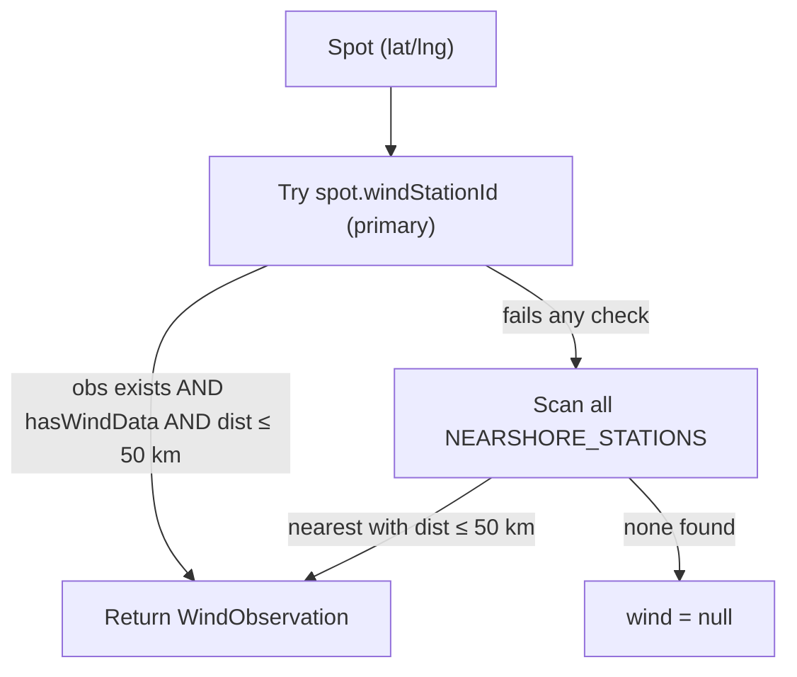
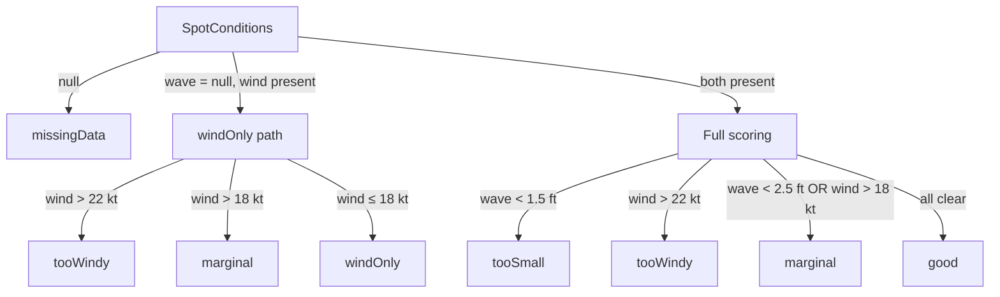

# NOAA NDBC Data Pipeline — Story of a Swell

Narrative walkthrough of how wave and wind data travels from NOAA buoys through the app to a surfability score. Use this when extending scoring, adding stations, or building new features on top of live conditions.

**Related:** [MVP_VALIDATION.md](./MVP_VALIDATION.md) for spot-by-spot validation steps.

---

## Act 1: The Source — What NOAA Actually Publishes

NOAA's National Data Buoy Center (NDBC) maintains a single flat text file updated every ~10 minutes at:

```
https://www.ndbc.noaa.gov/data/latest_obs/latest_obs.txt
```

Every buoy and station on the Great Lakes and open ocean writes **one line** to this file. A wave buoy line looks like:

```
45029  42.900  -86.272  2026  07  03  13  50  220  5.1  7.2  1.8  10  9  240  1015.4  1015.5  14.2  9.1
```

That's `[stationId] [lat] [lng] [YYYY MM DD HH mm] [WDIR] [WSPD m/s] [GST m/s] [WVHT m] [DPD s] [APD s] [MWD] [PRES hPa] ... [ATMP °C] [WTMP °C]`.

A pier/C-MAN station line looks the same but the wave fields (`WVHT`, `DPD`) contain `MM` (missing) because it's mounted on a structure at the shoreline, not floating offshore in swell.

---

## Act 2: Getting the File — The Proxy

The app fetches this one giant file once per spot selection. Because the browser can't hit `ndbc.noaa.gov` directly (CORS), there's a Vite dev proxy:

**[`frontend/vite.config.ts`](../../vite.config.ts)**

```
/api/ndbc/latest_obs.txt  →  https://www.ndbc.noaa.gov/data/latest_obs/latest_obs.txt
```

**[`frontend/src/services/noaa.ts`](../services/noaa.ts)** — line 18:

```ts
const NDBC_LATEST_URL = import.meta.env?.VITE_NDBC_URL ?? '/api/ndbc/latest_obs.txt'
```

In production (S3 deploy), `VITE_NDBC_URL` points at `backend/main.py`'s `GET /api/ndbc/latest_obs.txt` — a server-side proxy, since NDBC sends no CORS header and the browser can't call it directly. The backend is deployed via `.github/workflows/deploy-backend.yml` (Fly.io); see `CONTEXT.md`'s "CI/CD" section for the one-time setup this still needs. The FastAPI backend also handles email capture and admin-gated private spots — its *legacy* location-CRUD endpoints are the only unused part.

---

## Act 3: Parsing — Every Line Gets Decoded

`parseNdbcLine()` in `noaa.ts` reads each whitespace-split line and converts units:

| Raw NDBC field | Code field | Conversion |
|---|---|---|
| `WSPD` (m/s) | `windSpeedKt` | `× 1.94384` |
| `GST` (m/s) | `gustKt` | `× 1.94384` |
| `WVHT` (m) | `waveHeightFt` | `× 3.28084` |
| `ATMP` (°C) | `airTempF` | `(c × 9/5) + 32` |
| `WTMP` (°C) | `waterTempF` | same |
| `PRES` (hPa) | `presInHg` | `× 0.02953` |
| `MM` or blank | any field | `null` |

Any observation with a timestamp older than **2 hours** is flagged `isStale`.

The result is a `Map<stationId, RawNdbcObservation>` — a lookup table of every station that reported in this cycle.

---

## Act 4: The Two-Station Model — Wind vs. Wave Are Separate Streams

This is the most important architectural decision. The app maintains **two distinct station lists** in **[`frontend/src/data/stationCatalog.ts`](../data/stationCatalog.ts)**:

### Wind sources — nearshore, `hasWaves: false`

These are pier sensors, C-MAN platforms, and harbor instruments mounted at or near the shoreline. They report accurate local wind but are in sheltered or nearshore water; their `WVHT` is never used.

- `CHII2` — Chicago Harrison-Dever Crib (offshore crib, 41.916°N)
- `MCYI3` — Michigan City Pier
- `SVNM4` — South Haven C-MAN
- `MKGM4` — Muskegon Coast Guard
- `MLWW3` — Milwaukee Harbor
- `SGNW3` — Sheboygan
- `45186` — Waukegan Buoy

### Wave sources — offshore, `hasWaves: true`

These float in open lake, away from shoreline interference, and reliably report `WVHT`. Their wind readings exist but may differ from nearshore conditions.

- `45168` — St. Joseph Buoy
- `45029` — South Haven Buoy
- `45024` — Ludington Buoy
- `45026` — New Buffalo Buoy
- `45170` — Michigan City Buoy
- `45210` — Sheboygan Buoy
- `45214` — South Entry Light (`hasWind: false`, waves only)

Each surf spot in **[`frontend/src/data/surfSpots.ts`](../data/surfSpots.ts)** explicitly names both a `windStationId` and a `waveReferenceBuoyId`. For example, Montrose Beach uses `CHII2` for wind and `45214` for waves.

---

## Act 5: Resolution — Nearest Wins, with Fallback

`resolveWind()` and `resolveWave()` each run independently in `noaa.ts`:



The same pattern applies to `resolveWave()` scanning `WAVE_CAPABLE_OFFSHORE_BUOYS` within 100 km.

**Distance limits:**

- Wind: `MAX_NEARSHORE_WIND_KM = 50`
- Wave: `MAX_WAVE_REFERENCE_KM = 100`

Both are computed with `haversineDistanceKm()` from `lib/geo/haversine.ts`.

---

## Act 6: Quality — Confidence Comes from Distance + Freshness

`windQuality()` and `waveQuality()` translate physical proximity into epistemic confidence:

| Distance | Freshness | Wind quality | Wave quality |
|---|---|---|---|
| < 5 km, fresh | — | `high` | — |
| < 15 km, fresh | — | `medium` | — |
| < 10 km, fresh | — | — | `medium` |
| > 15 km or stale | — | `low` | `low` |

Overall `SpotConditions.quality` = worst of wind and wave quality. This flows directly into `SurfabilityScore.confidence`.

---

## Act 7: Scoring — The Surfability Decision Tree

`computeSurfability()` in **[`frontend/src/lib/surfability.ts`](../lib/surfability.ts)** takes `SpotConditions` and outputs a `SurfabilityScore`.

**Thresholds:**

- `MIN_WAVE_FT = 1.5` — below this: `tooSmall`
- `GOOD_WAVE_FT = 2.5` — below this but above min: `marginal`
- `MARGINAL_WIND_KT = 18` — above this: `marginal`
- `HIGH_WIND_KT = 22` — above this: `tooWindy`



Wind direction and wave period (`DPD`, `MWD`) are parsed and displayed but **not used in scoring** — they are available raw for any future enhancement.

---

## Act 8: Display — What the User Sees

The hook **[`frontend/src/hooks/useBuoyData.ts`](../hooks/useBuoyData.ts)** orchestrates everything:

```
useBuoyData(pin)
  → fetchSpotConditions(spot)           // fetch + parse + resolve
  → computeSurfability(conditions)    // score
  → { conditions, surfability, loading, error }
```

`NoaaReadings` renders the wind block and wave block. `SurfabilityBadge` renders the overall verdict. The `inferenceNote` string explains which stations were used and how far away they were.

---

## Worked Example: Montrose Beach

Tracing one swell from open water to the UI:

1. **Buoy 45214** (South Entry Light) reports `WVHT = 1.8 m` (~5.9 ft), `DPD = 10 s`, `MWD = 240°` in `latest_obs.txt`.
2. **Crib CHII2** reports `WSPD = 5.1 m/s` (~10 kt), `WDIR = 220°` — no usable WVHT (`MM`).
3. Vite proxy serves the file to the browser; `parseNdbcLatestObs()` builds a station map.
4. User selects Montrose (`windStationId: CHII2`, `waveReferenceBuoyId: 45214`).
5. `resolveWind()` returns CHII2 wind (~4 km, `high` quality).
6. `resolveWave()` returns 45214 waves (~distance varies, offshore reference).
7. `computeSurfability()` sees waves ≥ 2.5 ft and wind ≤ 18 kt → `good`.
8. UI shows two blocks (wind nearshore, waves offshore) plus a Surfability badge.

---

## Engineering Extension Points

These are the specific seams where new logic can be inserted without breaking existing behavior:

| Extension | Data already available | Touch points | Complexity |
|---|---|---|---|
| Period-weighted scoring | `dominantPeriodS` on `WaveObservation` | `lib/surfability.ts` | Low |
| Gust flag | `gustKt` on `WindObservation` | `lib/surfability.ts`, `NoaaReadings.tsx` | Low |
| Swell direction filtering | `meanDirDeg` on wave, spot `lat`/`lng` | `surfSpots.ts` (add orientation), `noaa.ts` or `surfability.ts` | Medium |
| Multi-buoy averaging | all buoys in `WAVE_CAPABLE_OFFSHORE_BUOYS` within range | `resolveWave()` in `noaa.ts` | Medium |
| Staleness decay | `observedAt` on observations | `windQuality()` / `waveQuality()` in `noaa.ts` | Low |
| New stations | station metadata | `data/stationCatalog.ts` | Low |

Fields parsed but **not** used in scoring today: `dominantPeriodS`, `avgPeriodS`, `meanDirDeg`, `wind.dirDeg`, `gustKt`.

---

## Recommended Next Build (Priority Order)

For Lake Michigan engineering, prioritize extensions that improve signal quality with minimal new data dependencies:

### 1. Period-weighted scoring (recommended first)

**Why:** DPD distinguishes wind chop from real swell. A 2 ft wave at 10 s is very different from 2 ft at 4 s. `heightFt × dominantPeriodS` is a simple energy proxy and all inputs are already parsed.

**Where:** Extend `computeSurfability()` in `lib/surfability.ts`. Keep existing height thresholds as a floor; add a marginal band when height is OK but period is short (e.g. DPD < 6 s).

**Risk:** Low — additive logic, easy to explain in UI copy.

### 2. Gust-to-sustained flag

**Why:** `gustKt` is already parsed and shown in the detail panel. A `gusty` flag when `gustKt / speedKt > 1.4` improves "blown out" detection without new fetches.

**Where:** `computeSurfability()` + optional badge in `SurfabilityBadge.tsx`.

**Risk:** Low.

### 3. Swell direction vs. spot exposure

**Why:** Lake Michigan breaks are highly direction-dependent. `meanDirDeg` from the offshore buoy can be compared to each spot's ideal swell window once spots carry an `exposureDeg` or `idealSwellFromDeg` field.

**Where:** Add orientation metadata to `surfSpots.ts`; gate or downgrade score in `surfability.ts` when swell direction is outside the window.

**Risk:** Medium — requires curated per-spot orientation data and clear UX when direction is wrong but height looks good.

### 4. Multi-buoy wave reference

**Why:** Some spots sit between buoys (e.g. South Haven uses `45029` ~55 km away). Averaging or weighting multiple in-range buoys could stabilize readings.

**Where:** Refactor `resolveWave()` to return primary + contributors, or a distance-weighted mean.

**Risk:** Medium — harder to explain in `inferenceNote`; test with `npm run test:data`.

### 5. Finer staleness confidence

**Why:** Binary `> 2 h` stale loses nuance. A 90-minute-old reading could decay confidence gradually.

**Where:** `windQuality()` / `waveQuality()` in `noaa.ts`.

**Risk:** Low — mostly affects badge confidence, not core flags.

---

## Key Source Files

| File | Role |
|---|---|
| `services/noaa.ts` | Fetch, parse, resolve wind/wave per spot |
| `data/stationCatalog.ts` | Nearshore vs offshore station allowlists |
| `data/surfSpots.ts` | Per-spot `windStationId` + `waveReferenceBuoyId` |
| `lib/surfability.ts` | Threshold scoring |
| `lib/geo/haversine.ts` | Distance from spot to station |
| `hooks/useBuoyData.ts` | React hook wiring fetch → score |
| `components/NoaaReadings.tsx` | Wind + wave display |
| `vite.config.ts` | Dev proxy to NDBC |
